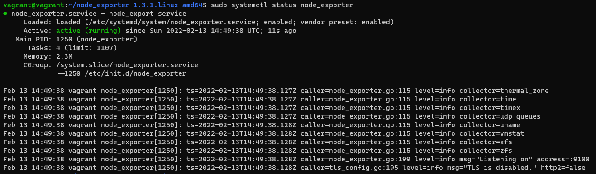
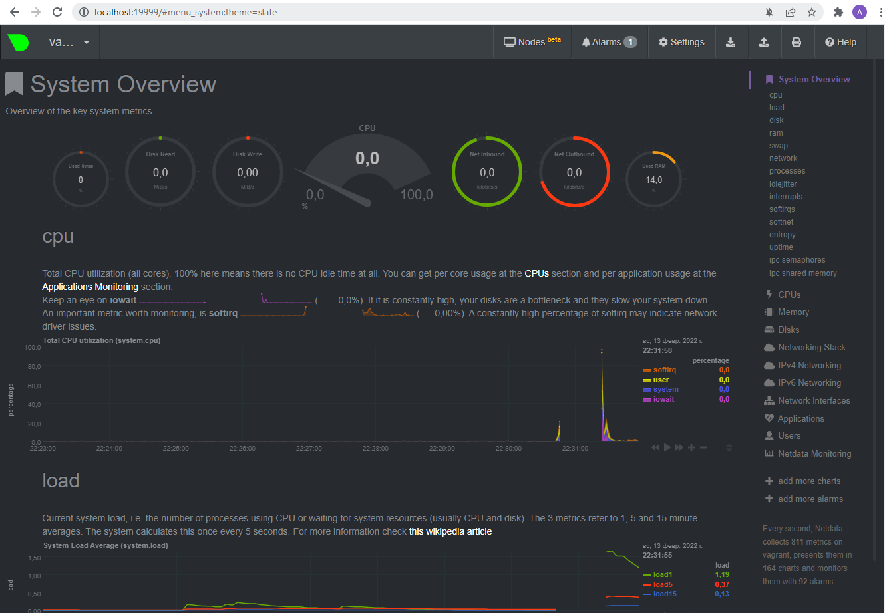
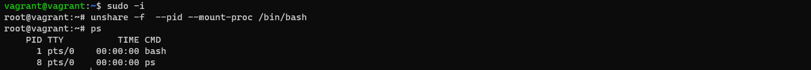

**Ответ на вопрос №1:**  
Скачал и распаковал исполняемый файл node_exporter.service с гитхаба.  
Добавил юнит [node_exporter.service](node_exporter.service)  
Проверил старт/стоп службы, добавил в автозапуск, после перезагрузки системы служба работает:  

**Ответ на вопрос №2:**  
 Ознакомился  с опциями node_exporter и выводом curl localhost:9100/metrics, выбрал следующие метрики:  
--collector.cpu.info  
--collector.meminfo  
--collector.diskstats  
--collector.netstat  
**Ответ на вопрос №3:**  

**Ответ на вопрос №4:**  
Да, можно dmesg |grep virtualiz выдает в т.ч. строку:  
[   12.984329] systemd[1]: Detected virtualization oracle.  
**Ответ на вопрос №5:**  
fs.nr_open = 1048576  
Это максимальное число открытых дескрипторов.  
**Ответ на вопрос №6:**  
unshare -f  --pid --mount-proc /bin/bash  

**Ответ на вопрос №7:**  
:(){ :|:& };: - это рекурсивная функция запускающая 2 экземляра себя самой.  
max user processes (-u) 3691, пользователь может в сессии создать 3691 процесс.  
С помощью команды ulimit -u n, где n - максимальное кол-во процессов в сессии.