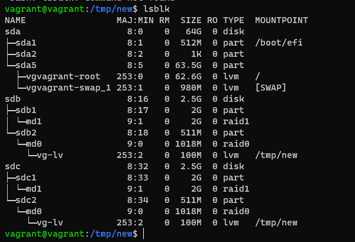
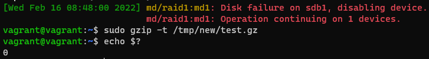

**Ответ на вопрос №1:**  
Узнал. Это файлы в которых последовательные нулевые байты заменены на инфу о них.  
**Ответ на вопрос №2:**  
Не могут, потому-что у них одинаковый inode  
**Ответ на вопрос №14:**  

**Ответ на вопрос №19:**  
