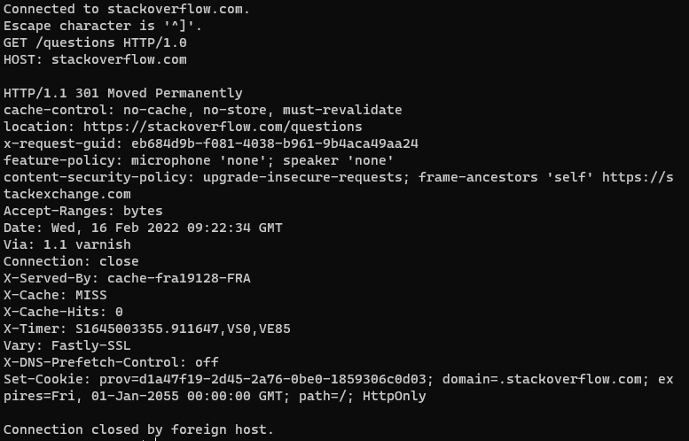
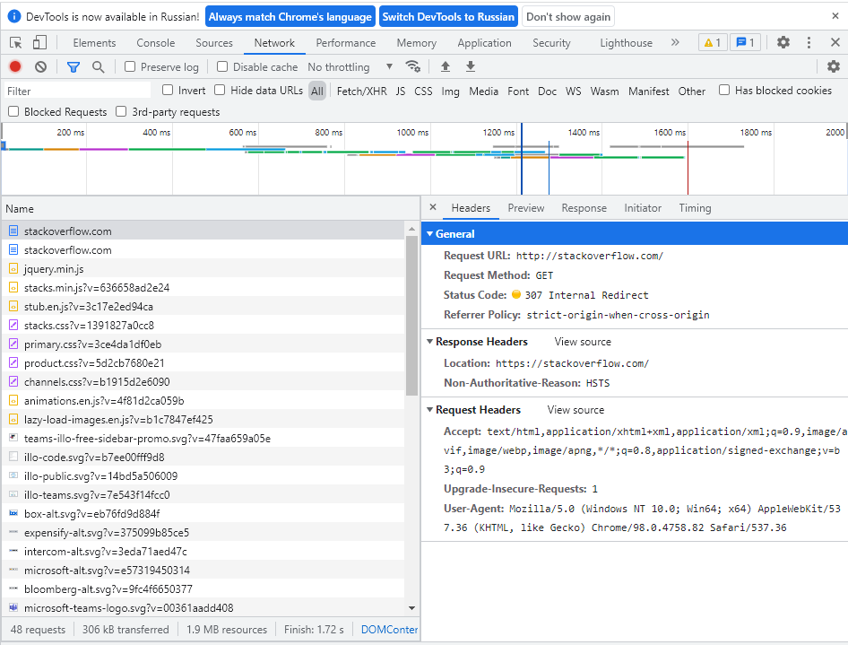
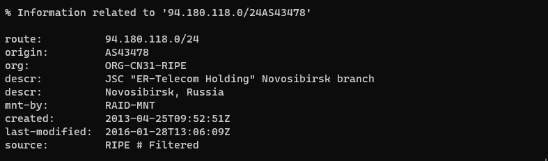
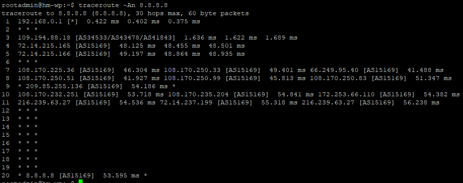
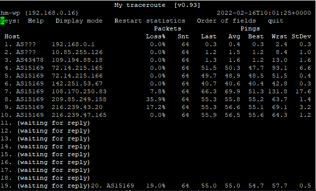
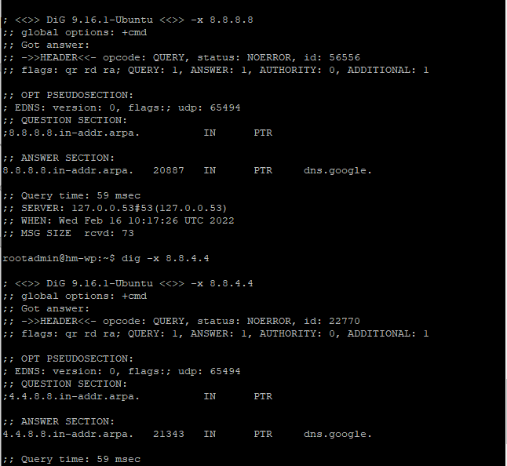

**Ответ на вопрос №1:**  
В ответ прилетает перенаправление на https  
  
**Ответ на вопрос №2:**  
Первый ответ, аналогично первому пункту ДЗ, редирект на https  
Дольше всего (243.46ms) выполнялся:  
https://cdn.sstatic.net/Fonts/roboto-slab/roboto-slab-regular-webfont.woff?v=a75088a46d79  
  
**Ответ на вопрос №3:**  
94.180.118.71  
**Ответ на вопрос №4:**  
JSC "ER-Telecom Holding" Novosibirsk branch  
AS43478  
  
**Ответ на вопрос №5:**  
  
**Ответ на вопрос №6:**  
Самая большая средняя задержка на адресе 108.170.250.83  
  
**Ответ на вопрос №7:**  
8.8.4.4   
8.8.8.8  
  
**Ответ на вопрос №7:**  
8.8.4.4 - dns.google.  
8.8.8.8 - dns.google.  
  