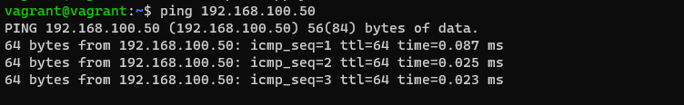

**Ответ на вопрос №1:**  
windows (cmd): netsh interface show interface  
windows (ps):  Get-NetAdapter  
linux: ip link  
**Ответ на вопрос №2**  
lldp  
**Ответ на вопрос №3**  
vlan
пример настройки в файле [01-netcfg.yaml](01-netcfg.yaml)  
  
**Ответ на вопрос №4**  
ifenslave  
пример настройки в файле [interfaces](interfases)  
**Ответ на вопрос №5**  
в сети с маской /29 6 хостов:  
  
В сети с маской /24 32 сети c маской /29 (29-24)^2  
Примеры подсетей /29 в сети 10.10.10.0/24 ниже:  
  
**Ответ на вопрос №6**  
100.64.0.0/26  
  
**Ответ на вопрос №7**  
В windows команда arp -a  
В linux команда arp -n  
Команда очистки всего arp кэша в windows "netsh interface ip delete arpcache"  
Команда очистки всего arp кэша в linux не нашел, как вариант можно выполнить:  
sudo ip link set arp off dev eth0 ;sudo ip link set arp on dev eth0  
Для удаления одной записи используется команда arp -d  
