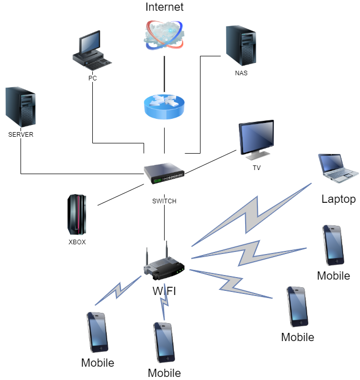

**Ответ на вопрос №1:**  
  
**Ответ на вопрос №2:**  
Добавил dummy интерфейс c IP 192.168.100.2/32 с помощью netplay [00-dummy.yaml](00-dummy.yaml)  
  
**Ответ на вопрос №3:**  
22 - ssh  
53 - dns  
111 - rpcbind  
  
**Ответ на вопрос №4:**   
53 - dns  
68 - dhcp  
111 - rpcbind  
  
**Ответ на вопрос №5:**   
  