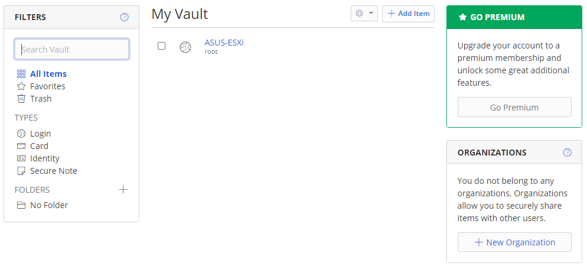
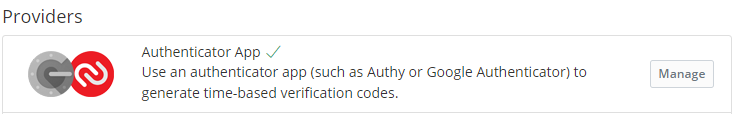
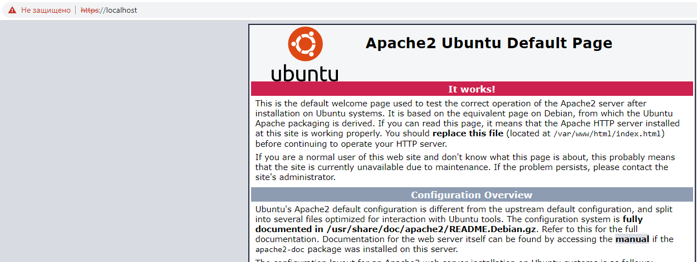
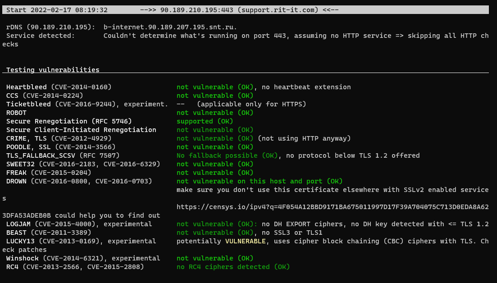
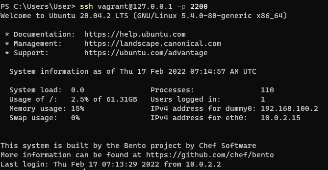
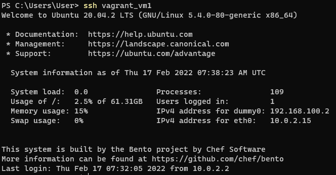
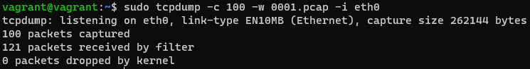
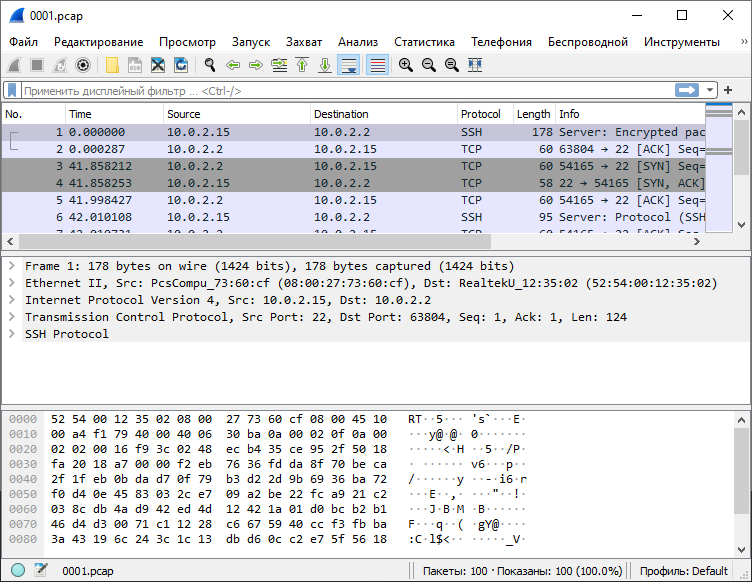
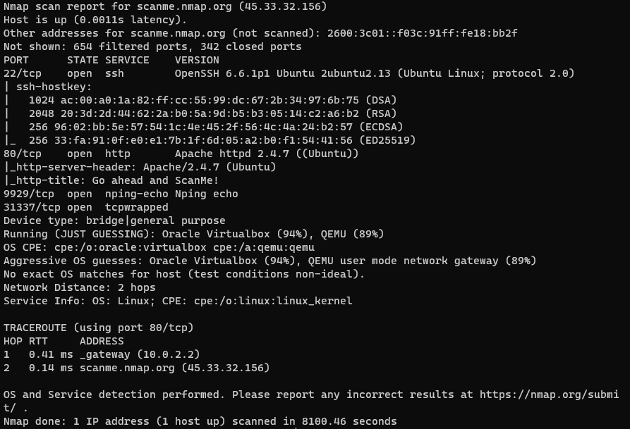
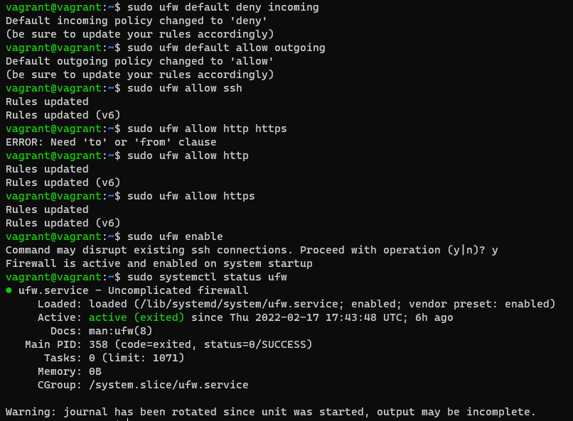

**Ответ на вопрос №1:**  
  
**Ответ на вопрос №2:**  
  
**Ответ на вопрос №3:**  
добавил самоподписанный сертификат:  
sudo openssl req -x509 -nodes -days 365 -new -keyout /etc/ssl/private/apache-selfsigned.key -out /etc/ssl/certs/apache-selfsigned.pem  
проверил пусть к сертификату и ключу в файле default-ssl.conf  
создал жесткую ссылку на файл настроек ssl в папку sites-enabled:  
sudo ln default-ssl.conf ../sites-enabled/default-ssl.conf  
включил ssl в apache:
sudo a2enmod ssl
перезапустил apache, загрузился сайт https://localhost (до этого пробросил порт 443)  
  
**Ответ на вопрос №4:**  
  
**Ответ на вопрос №5:**  
  
**Ответ на вопрос №6:**  
Переименовал файл ключа в id_rsa_new  
Добавил в ssh agent новый ключ:  
ssh-add ~\.ssh\id_rsa_new  
Добавил файл [config](config)  
Подключился по имени:  
  
**Ответ на вопрос №7:**  
Собрал tcpdump 100 пакетов в файл [0001.pcap](0001.pcap)  
  
Открыл полученный файл в wireshark:  
  
**Ответ на вопрос №8:**  
22/tcp - ssh  
80/tcp - http  
9929/tcp - nrip-echo  
31337/tcp - tcpwrapped  
  
**Ответ на вопрос №9:**  
Установил ufw, закрыл все входящие соединения открыл порты 22,80,443.  
Включил ufw, ssh не отвалился web сервер доступен  
  
